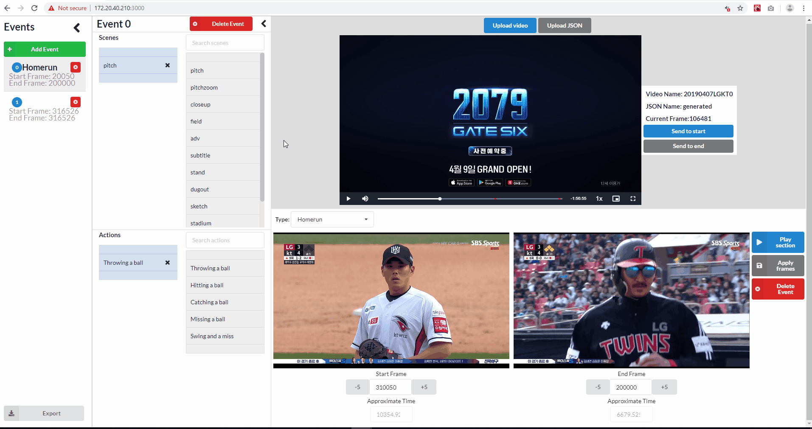
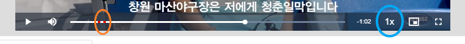
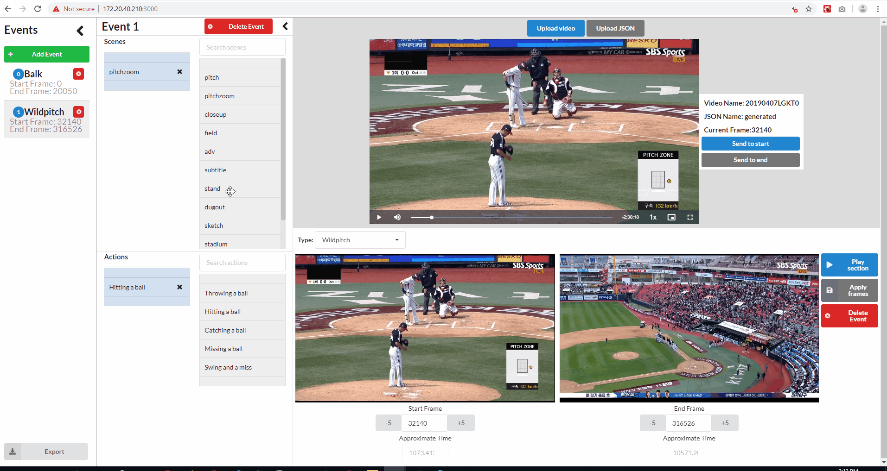
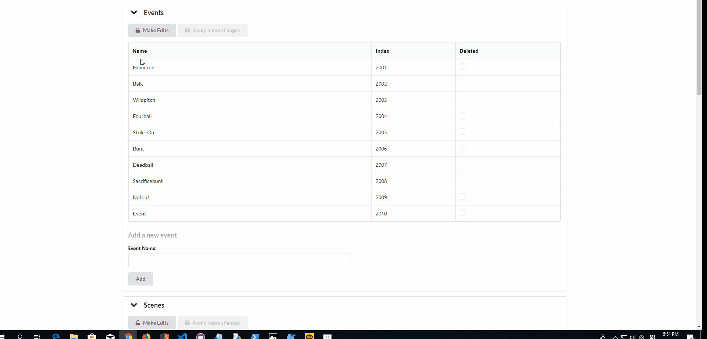
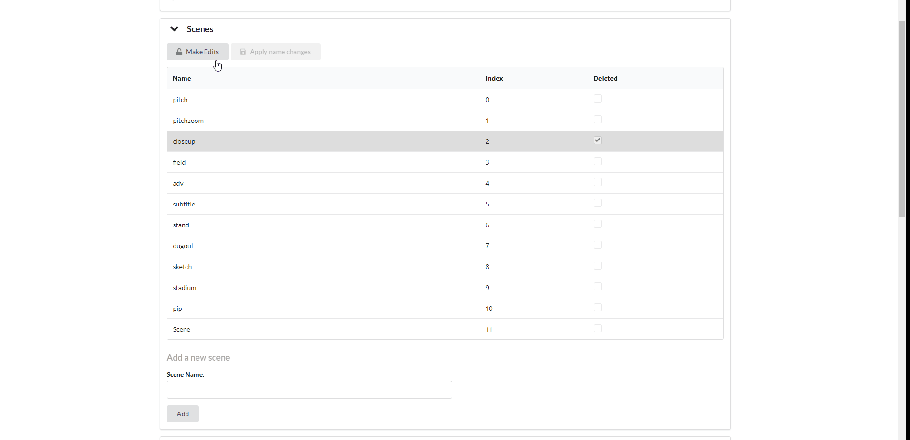

# Video Annotation

A web application for video annotation.

## Features

- Allows users to annotate video by segmenting into different events, and labeling each event with the event type, scenes, and actions
- Frontend-only frame seeking as accurate as HTML5 video browser frame seeking
- Admin portal to edit scenes and actions for users
- Restores browser state on upload of previously-edited video
- Export functionality to get edited metadata

## Development

### Installation

Install node.js (>=10.x) and yarn. Then install the node modules:

```bash
cd server
yarn install
cd ../client
yarn install
cd ..
yarn install
```

### Launching the app

Then, run the development mode.

```bash
yarn start
```

## Build For Production

Install node.js (>=10.x) and yarn. Then install the node modules:

```bash
cd server
yarn install
cd ../client
yarn install
cd ..
yarn install
```

Build the client app:

```bash
cd client && yarn run build && cd ..
```

Run the server app in production mode serving the client build:

```bash
env PORT=3000 NODE_ENV=production node server/src/index.js
```

## Detailed Functionality

Note that some of the gifs below have been made before the addition of frame increment buttons.

### Annotation

#### Setting up (on video upload):

- If previously edited before, there is an option to restore the browser state from the last time the video was edited.
  

- You can also upload a JSON anytime with at least the following structure. Doing so will set the tool to edit from the information stored in the JSON. (Note that duration is in seconds, replace VIDEO_NAME with name of video, and fill in duration and fps according to the video's metadata.)

```json
{
  "database": {
    "VIDEO_NAME": {
      "duration": 123,
      "fps": 123,
      "annotations": []
    }
  }
}
```

Sample full JSON structure:


Uploading JSON upon video upload.


Uploading JSON in the middle of editing.


- The user can also annotate from scratch. Note that the user might have to wait some time for the blank state to initialize (on testing, typically around 1-2 secs)


Note that since there is no user ID, there is no measure against someone editing the same video and overwriting someone else's last edits. To ensure that the user is resuming his/her previous edits, the user is advised to upload the matching json, which the user can export anytime during the session.

#### Collapsible side panels

When the tool is in use, there are two sidebars - the leftmost is the events sidebar, and the other is the scenes/actions sidebar. Both can be collapsed with the < button. The events sidebar can be reopened with the &#9776; button, while the scenes/actions sidebar can be reopened with the click of an event from the events sidebar.



#### Events

An event has a type, start frame, end frame, scenes and actions.

The events in the sidebar are auto-sorted by start time. Adding an event creates a new event that by default has the start frame of one plus the end frame of the last event in the sidebar and the end frame of the last frame in the entire video. Deleting an event will remove the event and shift the focus to the event before it.

To help with editing the start and end frames, the tool provides a preview of the screen corresponding to the frame number. To increment or decrement the frames by 1 it is recommended for users to use the &#8593; and &#8595; arrow keys. There are buttons beside the input that help with incrementing/decrementing the frames by 5 as well.

The user can also navigate the video and click 'Send to start' or 'Send to end' buttons to set the event start and end frame respectively. Note that the red video markers shown (circled in orange) along the progress bar represent the current frames in the input and **not** the saved frames. The saved start and end frame for a given event can be viewed in the sidebar. To help with video navigation, there is also a video playback rate (circled in blue) that can be adjusted.



Sample edit procedure:


Whenever the user clicks on an event from the sidebar, it plays the section based on the start and end time associated with the event. If the user is editing an event with unsaved changes and clicks on the same event in the sidebar, the video will play frames based on the unsaved changes. Otherwise, the video will play frames based on the saved frames. This playing behavior is emulated by the 'Play Section' button, which plays the section described by the frame inputs on the screen.

After setting the event start frame and end frame, please be sure to **click the apply frames button to save**.

#### Scenes and Actions

The user annotates the scenes and actions of a given event by dragging a scene/action from the grey box and moving it into the blue box. The blue box contains the event's annotated scenes/actions while the grey box contains all valid scenes/actions options. The search bar on top of the grey box allows the user to filter the scenes/actions options.

Note that the scenes/actions in the blue box are sortable and can also be deleted through the X button.



#### Events, Scenes and Actions "Deletion"

If an event is "deleted" from the admin app, it can no longer be seen as an option by the user in the annotation app through the event selection dropdown but can be seen in the sidebar.

It is displayed as an empty string.

However such an event type is not considered valid, and navigating away from an event with an invalid or not-selected type will cause an alert.

If a scene or action is "deleted", it can no longer be seen as an option by the user in the annotation app through the grey options drag-and-drop searchable list but can be seen in the blue drag-and-drop selected list if it was selected before.

#### Events, Scenes, and Actions Rename

If an event, scene, or action is renamed, the new name will replace the old name in all instances.

#### Saving

All modifications on a given (except for modifying the start/end frames) are auto-saved.

There are precautions enabled to ensure that the user does not forget some parts of the annotation. When the user leaves the current event (which occurs when the user adds a new event or clicks on a different event in the sidebar), as well as when the user is exporting the JSON, the tool checks whether:

- the current event has a valid type
- the current event's scenes are not empty
- the current event's actions are not empty.
- the current event's start and end frames are saved.

If any of the first three conditions is true, the tool launches an alert to notify the user before the process continues.

If the last condition is true, the tool shows a confirmation alert for the user to choose whether or not to proceed with the process.


#### Undo/Redo

The tool stores an edit history containing at most 20 saved states at any time and provides an undo/redo functionality. Undoing will go back to the tool's last saved function, and is triggered by the keyboard shortcut <kbd>CTRL</kbd>+<kbd>Z</kbd>. Redoing is triggered by the keyboard shortcuts <kbd>CTRL</kbd>+<kbd>Y</kbd> and <kbd>Shift</kbd>+<kbd>CTRL</kbd>+<kbd>Z</kbd>.

#### Export

Clicking the export button in the lower lefthand corner (visible in both collapsed and uncollapsed events sidebar) will export the JSON containing the last saved annotations. The filename of the exported JSON will be:

- If restored, the restored JSON filename appended with "\_changed"
- If uploaded, the uploaded JSON filename appended with "\_changed"
- If scratch, "generated_changed"

### Admin

Admin can edit the events, scenes, and actions that serve as the users options in the annotation app.

#### Add



#### "Delete"

To delete, first click the make edits button, then delete the desired events, and then lock.


#### Rename

To rename, first click the make edits button, then rename the desired events, then click `Apply name changes`, and then lock.


## Logic

### Initialization

Upon video upload, the video annotation tool creates a blank JSON with the minimum JSON structure mentioned above by calculating video metadata (fps, duration) through MediaInfo.js.

This blank JSON will be used whenever the user does not restore from the database or upload a correctly-formatted JSON.

### Frame-by-frame seeking accuracy

Frame seeking accuracy of the video annotation tool uses VideoJS (which in turn relies on HTML5 video). Hence, the accuracy of the frame seeking is as accurate as HTML5 video frame seeking (See Issue #2 for more details). On testing, it is found to be 1 frame off compared to a non-browser OpenCV application.

Additionally, the `Play section` button is not as accurate as frame-seeking and will hence sometimes pause moments after the event's end frame. This is due to the frequency of VideoJS' `timeupdate` callback event.

## Project Support and Development

This project has been developed as part of my internship at the [NCSOFT](http://global.ncsoft.com/global/) Vision AI Lab in the summer of 2019.
